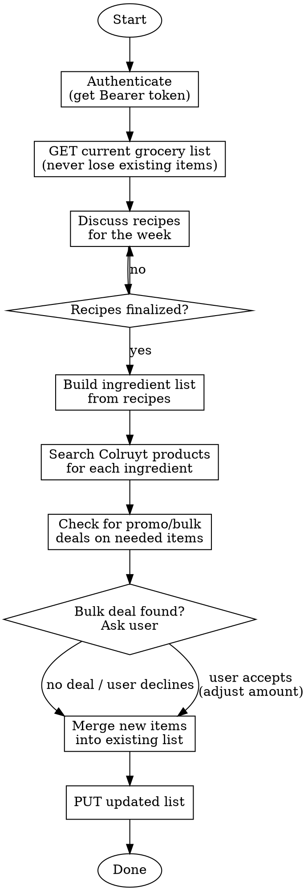

# Grocery List Manager

Plan weekly meals and populate the Colruyt-X grocery list at https://colruyt-x.vercel.app.

## Workflow



## Phase 1: Authentication

Authenticate once at the start of the conversation using the APP_PIN from the project `.env` file.

```bash
# Login and capture token
curl -s -X POST https://colruyt-x.vercel.app/api/auth/login \
  -H "Content-Type: application/json" \
  -d '{"pin":"<PIN>"}' | jq -r '.token'
```

Store the token and use it as `Authorization: Bearer <token>` on all subsequent requests.

## Phase 2: Fetch Current List

**CRITICAL: Always fetch the existing list BEFORE making changes. Never lose existing items.**

```bash
curl -s https://colruyt-x.vercel.app/api/list \
  -H "Authorization: Bearer <token>"
```

The `items` field is a JSON string. Parse it and preserve all existing items when merging.

## Phase 3: Recipe Discussion

Propose recipes sourced from:
1. **Colruyt recipes** — https://www.colruyt.be/nl/recepten/alle-recepten?page=1
2. **Jeroen Meus / Dagelijkse Kost** — https://dagelijksekost.vrt.be/

Guidelines:
- Recipes are for **4 people: 2 adults + 2 children (age 6)**
- Suggest a mix of quick weekday meals and slightly more involved ones
- Consider seasonal ingredients
- Wait for user to finalize the recipe list before proceeding

Use WebFetch to browse recipe pages and extract ingredients. The user decides which recipes we're cooking.

## Phase 4: Build Ingredients & Search Products

For each ingredient needed:

```bash
# Search Colruyt product catalog
curl -s "https://colruyt-x.vercel.app/api/products?q=<ingredient>&limit=10" \
  -H "Authorization: Bearer <token>"
```

Match ingredients to real Colruyt products. Each grocery list item uses this structure:

```json
{
  "name": "Product name",
  "amount": "2",
  "unit": "stuks",
  "category": "Category from product data",
  "checked": false,
  "productId": "product-id-if-matched",
  "price": 2.99
}
```

## Phase 5: Promo & Bulk Deal Check

When searching products, check `is_promo` field. If a needed product is on promotion:
- **Tell the user** which product is on sale and at what price
- **If buying more triggers a better deal**, ask whether to increase the quantity
- Let the user decide — don't auto-increase

## Phase 6: Merge & Update List

**NEVER remove existing items** unless the user explicitly asks.

Merge strategy:
1. Parse existing `items` from the current list
2. For each new ingredient:
   - If an item with the same `productId` or `name` already exists, **increase the amount**
   - Otherwise, append as a new item
3. PUT the merged list:

```bash
curl -s -X PUT https://colruyt-x.vercel.app/api/list \
  -H "Authorization: Bearer <token>" \
  -H "Content-Type: application/json" \
  -d '{"items": [<merged items array>]}'
```

## Quick Reference

| Action | Endpoint | Method |
|--------|----------|--------|
| Login | `/api/auth/login` | POST `{"pin":"..."}` |
| Get list | `/api/list` | GET |
| Update list | `/api/list` | PUT `{"items":[...]}` |
| Search products | `/api/products?q=...&limit=20` | GET |
| Get product | `/api/products/:id` | GET |
| Get categories | `/api/products/categories` | GET |
| Clear checked | `/api/list/clear-checked` | POST |

## Common Mistakes

- **Overwriting the list**: Always GET first, merge, then PUT. Never PUT without fetching.
- **Forgetting auth**: Every API call (except login) needs the Bearer token.
- **Wrong amounts**: Recipes are for 4 people. Don't scale unless asked.
- **Removing items**: Only remove items when explicitly told. The list accumulates.
- **Ignoring promos**: Always check `is_promo` on product results and surface deals.
